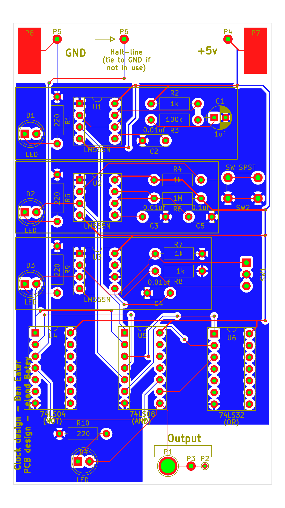

Clock-module
============

This repo contains PCB designs for the first component of Ben Eater's
educational 8-bit CPU, the clock module. You can [watch Mr. Eaters *fantastic*
series on designing and building this CPU on his Youtube
channel.](https://www.youtube.com/user/eaterbc/videos)

